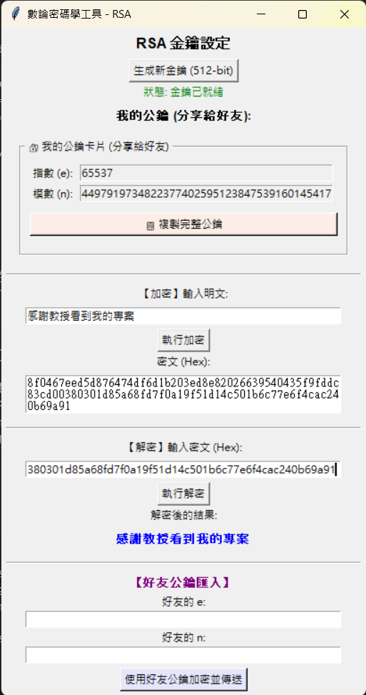

🔐 RSA-Crypto-Tools: 數論與基礎密碼學實作

    這是一個使用 Python 從零開始實作的 RSA 非對稱加密工具。
    本專案不依賴高層加密庫（如 PyCryptodome），而是直接實作數論中的核心演算法，並整合了 Tkinter GUI 介面，
    提供直觀的金鑰管理與訊息傳遞功能。
    
🚀 功能亮點完整 RSA 流程：包含大質數生成、金鑰配對、加密及解密。

    好友加密模式：支援匯入好友的公鑰（$e$, $n$），實現真正的端到端訊息加密。
    自動化工具箱：整合一鍵複製金鑰與密文的功能，優化使用者體驗。
    純 Python 實作：核心數學運算均由原生程式碼達成，適合學習演算法邏輯。
🧠 核心演算法說明本專案實作了密碼學中多個經典的數論演算法：
1. 擴展歐幾里得演算法 (Extended Euclidean Algorithm)用於計算模反元素 (Modular Multiplicative Inverse)。在已知公鑰 $e$ 與 $\phi(n)$ 的情況下，求解滿足下式的私鑰 $d$：  $$ed \equiv 1 \pmod{\phi(n)}$$
    
2.  Miller-Rabin 質數測試由於傳統試除法效率過低，專案採用 Miller-Rabin 機率性測試來確保生成的 $p, q$ 為大質數，確保金鑰生成的效率與安全性。
3.  快速冪取模 (Modular Exponentiation)利用平方求模法處理超大數量的次方運算，避免記憶體溢位並大幅提升運算速度。
    1.  加密： $C = M^e \pmod n$ 
    2.  解密： $M = C^d \pmod n$

🛠️ 專案架構

    Crypto-Math-Tools/
    ├── GUI.py           # Tkinter 介面邏輯與交互設計(舊版)
    ├── GUI2.py          # Tkinter 介面邏輯與交互設計(新版：加入了使用朋友的金鑰等功能)
    ├── RSACipher.py     # RSA 核心類別與金鑰管理
    ├── math_utils.py    # 數論基礎演算法庫 (GCD, EEA, Miller-Rabin)
    └── README.md        # 專案說明文件
📦 如何執行
    複製專案：
    
    git clone https://github.com/你的帳號/RSA-Crypto-Tools.git
    cd RSA-Crypto-Tools     
    執行程式：
    
    python GUI2.py
📸 介面展示              

📝 學習筆記
    這個專案是我學習基礎演算法的一部分。
    透過實作 RSA，我掌握了以下技能：
    
        1.理解非對稱加密中「公鑰加密、私鑰解密」的原理。
        2.掌握 O(log n) 時間複雜度的演算法設計。
        3.練習 Python 的模組化開發與 Tkinter GUI 佈局。                                                

